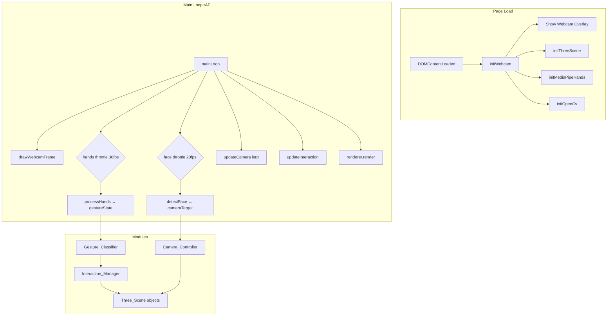
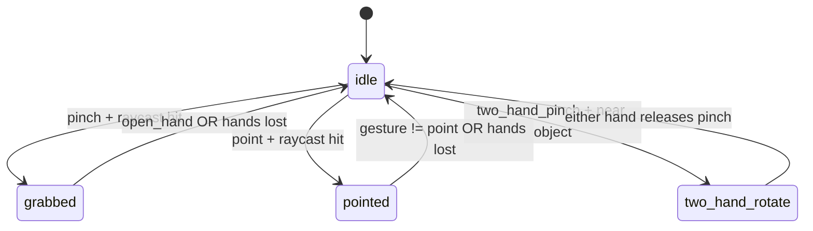

# Design Document

## mediapipe-3d-gesture-interaction

---

## Overview

This design replaces the Teachable Machine Pose + Spline 3D stack in `test-opt.html` with a new stack built on **MediaPipe Hands** and **Three.js**, while retaining the OpenCV Haar-cascade face detector for camera parallax. The result is a single self-contained HTML file where:

- The webcam starts immediately on page load.
- Three.js and MediaPipe Hands load progressively in the background via CDN.
- Hand gestures (pinch, point, open hand, two-hand pinch) drive 3D object interaction.
- Face position drives a parallax offset on the Three.js camera.
- A hand-skeleton overlay is drawn on the existing `outputCanvas` alongside the face bounding box.

All legacy TensorFlow.js, Teachable Machine, Spline, and key-dispatch code is removed.

---

## Architecture

The application is a single HTML file with all JavaScript inline. There is no build step. The architecture is a **cooperative frame-loop** pattern: a single `requestAnimationFrame` loop drives rendering, and throttled sub-loops handle the more expensive detection tasks.



### CDN Dependencies

| Library | CDN | Version |
|---|---|---|
| Three.js | `https://cdn.jsdelivr.net/npm/three@0.160.0/build/three.module.js` | 0.160.0 |
| MediaPipe Hands | `https://cdn.jsdelivr.net/npm/@mediapipe/hands@0.4.1646424926/hands.js` | 0.4.1646424926 |
| MediaPipe Camera Utils | `https://cdn.jsdelivr.net/npm/@mediapipe/camera_utils/camera_utils.js` | latest |
| OpenCV.js | `opencv.js` (local, async) | existing |
| Lottie Player | `https://unpkg.com/@lottiefiles/lottie-player@latest/dist/lottie-player.js` | existing |

Three.js is loaded via an `importmap` so that `import * as THREE from 'three'` works inline without a bundler.

---

## Components and Interfaces

### 1. Bootstrap / `startAppFlow()`

Responsible for sequencing initialisation. Runs only when `window.innerWidth > 768`.

```
startAppFlow()
  ├── initWebcam()          → resolves when stream is playing
  ├── initThreeScene()      → async, loads in background
  ├── initMediaPipeHands()  → async, loads in background
  └── initOpenCv()          → async, waits for opencv-ready event
```

Each init function sets a flag on a shared `state` object and calls `checkAppReady()`. The main loop starts as soon as `state.cameraReady` is true (not waiting for Three.js or MediaPipe).

### 2. `state` Object

Central mutable state shared across all modules:

```js
const state = {
  // Readiness flags
  cameraReady: false,
  threeReady: false,
  handsReady: false,
  cvReady: false,

  // Face detection
  currentFaceRect: null,       // { x, y, width, height } in outputCanvas coords
  lastFaceDetectedTime: 0,

  // Camera parallax target (updated by face detection, consumed by Camera_Controller)
  cameraTarget: { normX: 0, normY: 0 },

  // Gesture state (updated by Gesture_Classifier)
  gestureState: {
    left:  { gesture: 'none', pinchPoint: null, indexTip: null, bbox: null },
    right: { gesture: 'none', pinchPoint: null, indexTip: null, bbox: null },
    twoHandPinch: false,
  },

  // Interaction state (updated by Interaction_Manager)
  interaction: {
    mode: 'idle',              // 'idle' | 'grabbed' | 'pointed' | 'two_hand_rotate'
    targetObject: null,        // THREE.Mesh | null
    grabOffset: null,          // THREE.Vector3 offset at grab time
    prevPinchMidpoint: null,   // for two-hand rotation delta
    prevIndexPos: null,        // for point-rotate velocity
  },

  // Gesture debounce buffers
  debounce: {
    left:  { candidate: 'none', count: 0 },
    right: { candidate: 'none', count: 0 },
  },
};
```

### 3. `initWebcam()`

- Requests `{ video: { facingMode: 'user', width: { ideal: 640 }, height: { ideal: 480 } } }`.
- Sets `outputCanvas.width/height` to match the video stream.
- Sets `state.cameraReady = true` and shows the `#video-overlay`.
- On error: shows error message in `#camera-msg`.

### 4. `initThreeScene()`

Creates the Three.js scene, camera, renderer, and room geometry. Sets `state.threeReady = true` when complete.

**Scene contents:**
- `PerspectiveCamera` — FOV 60, near 1, far 2000. Base position `(0, 0, 600)`.
- `WebGLRenderer` — attached to `#canvas3d`, `antialias: true`, `alpha: false`.
- Room geometry — six `PlaneGeometry` meshes (floor, ceiling, back wall, left wall, right wall, front wall) with `MeshStandardMaterial` in off-white/cream tones.
- `AmbientLight` — intensity 0.8.
- `DirectionalLight` — position `(200, 400, 300)`, intensity 1.2, casts shadows.
- Interactive cube — `BoxGeometry(80, 80, 80)`, `MeshStandardMaterial({ color: 0x4a90d9 })`, centred at origin.

**Exported references:**
```js
window.threeScene   // THREE.Scene
window.threeCamera  // THREE.PerspectiveCamera
window.threeRenderer // THREE.WebGLRenderer
window.interactiveCube // THREE.Mesh — the grabbable object
```

### 5. `initMediaPipeHands()`

Loads the MediaPipe Hands solution and configures it:

```js
const hands = new Hands({ locateFile: (file) =>
  `https://cdn.jsdelivr.net/npm/@mediapipe/hands@0.4.1646424926/${file}`
});
hands.setOptions({
  maxNumHands: 2,
  modelComplexity: 1,
  minDetectionConfidence: 0.7,
  minTrackingConfidence: 0.5,
});
hands.onResults(onHandResults);
```

`onHandResults(results)` is the callback that:
1. Calls `classifyGestures(results)` to update `state.gestureState`.
2. Calls `drawHandSkeleton(results)` to draw on `outputCanvas`.

MediaPipe Hands is driven by calling `hands.send({ image: video })` inside the throttled hands branch of the main loop (max 30 fps).

### 6. `Gesture_Classifier` — `classifyGestures(results)`

Processes `results.multiHandLandmarks` and `results.multiHandedness` to produce gesture events.

**Landmark indices used:**

| Landmark | Index |
|---|---|
| Wrist | 0 |
| Thumb tip | 4 |
| Index MCP | 5 |
| Index tip | 8 |
| Middle tip | 12 |
| Ring tip | 16 |
| Pinky tip | 20 |

**Gesture detection logic:**

```
pinch:
  dist(landmark[4], landmark[8]) < PINCH_THRESHOLD (default 0.08 in normalised coords)

point:
  fingerExtended(index) == true
  AND fingerCurled(middle) == true
  AND fingerCurled(ring) == true
  AND fingerCurled(pinky) == true

open_hand:
  fingerExtended(index) == true
  AND fingerExtended(middle) == true
  AND fingerExtended(ring) == true
  AND fingerExtended(pinky) == true

two_hand_pinch:
  left.gesture == 'pinch' AND right.gesture == 'pinch'
```

`fingerExtended(finger)`: tip.y < MCP.y (in normalised image coords, y increases downward, so tip above MCP means extended).

`fingerCurled(finger)`: tip.y > MCP.y.

**Debounce:** Each hand maintains a `{ candidate, count }` buffer. A gesture is only committed to `state.gestureState` after 3 consecutive frames with the same classification.

**Pinch point** (used for raycasting and drag): midpoint of landmark[4] and landmark[8], in normalised video coords `[0,1]`.

**Bounding box** (used for depth estimate): `{ minX, minY, maxX, maxY }` over all 21 landmarks.

### 7. `drawHandSkeleton(results)`

Draws on `outputCanvas` (the same canvas used by face detection). Called after the webcam frame is drawn and after the face bounding box is drawn, so it composites on top.

- Connections: drawn as lines using the MediaPipe `HAND_CONNECTIONS` constant (21 pairs).
- Landmarks: drawn as small filled circles (radius 3 px).
- Colour: white lines, orange (`#F67D3E`) landmark dots.
- The canvas is already CSS-flipped (`transform: scaleX(-1)`), so no additional mirroring is needed in the drawing code.

### 8. `Camera_Controller` — `updateCamera()`

Called every rAF frame. Reads `state.cameraTarget` and lerps the Three.js camera.

```js
const BASE_POSITION = new THREE.Vector3(0, 0, 600);
const LERP_FACTOR = 0.08;
const X_SENSITIVITY = 80;   // world units per normalised unit
const Y_SENSITIVITY = 60;

function updateCamera() {
  const { normX, normY } = state.cameraTarget;
  const targetX = BASE_POSITION.x - normX * X_SENSITIVITY;
  const targetY = BASE_POSITION.y - normY * Y_SENSITIVITY;

  threeCamera.position.x += (targetX - threeCamera.position.x) * LERP_FACTOR;
  threeCamera.position.y += (targetY - threeCamera.position.y) * LERP_FACTOR;
  threeCamera.position.z = BASE_POSITION.z; // Z is not affected by face parallax
  threeCamera.lookAt(0, 0, 0);
}
```

When no face has been detected for > 500 ms, `state.cameraTarget` is reset to `{ normX: 0, normY: 0 }` so the camera lerps back to neutral.

### 9. `Interaction_Manager` — `updateInteraction()`

Called every rAF frame. Reads `state.gestureState` and `state.interaction` and applies transforms to `window.interactiveCube`.

**State machine:**



**Raycasting:**

```js
function raycastFromNormalisedPoint(normX, normY) {
  // normX, normY are in [0,1] normalised video space
  // Convert to NDC: x in [-1,1], y in [-1,1] (y flipped)
  const ndc = new THREE.Vector2(normX * 2 - 1, -(normY * 2 - 1));
  raycaster.setFromCamera(ndc, threeCamera);
  return raycaster.intersectObject(interactiveCube);
}
```

**Grabbed state — XY drag:**

On entry: record `grabOffset = cube.position - projectedWorldPoint`.

Each frame: `cube.position.x = projectedWorldPoint.x + grabOffset.x`, same for Y.

**Grabbed state — Z depth:**

```js
const bbox = state.gestureState.right.bbox; // or left
const bboxWidth = bbox.maxX - bbox.minX;    // normalised [0,1]
const DEPTH_MIN = -300, DEPTH_MAX = 300;
const HAND_SIZE_MIN = 0.10, HAND_SIZE_MAX = 0.40;
const t = clamp((bboxWidth - HAND_SIZE_MIN) / (HAND_SIZE_MAX - HAND_SIZE_MIN), 0, 1);
const targetZ = DEPTH_MAX - t * (DEPTH_MAX - DEPTH_MIN); // larger hand → smaller Z
cube.position.z += (targetZ - cube.position.z) * 0.1;    // lerp
```

**Pointed state — Y-axis rotation:**

```js
const currentIndexX = state.gestureState.right.indexTip.x;
const velocityX = currentIndexX - state.interaction.prevIndexPos.x;
cube.rotation.y += velocityX * ROTATE_SENSITIVITY; // default: 5.0
state.interaction.prevIndexPos = { x: currentIndexX };
```

**Two-hand rotate state:**

```js
const midpoint = midpointOf(leftPinch, rightPinch);
const currentVec = vectorBetween(leftPinch, rightPinch);
const prevVec = state.interaction.prevTwoHandVec;

const deltaAngleY = angleDelta(prevVec.x, currentVec.x); // horizontal → Y rotation
const deltaAngleX = angleDelta(prevVec.y, currentVec.y); // vertical → X rotation

cube.rotation.y += deltaAngleY * TWO_HAND_SENSITIVITY;
cube.rotation.x += deltaAngleX * TWO_HAND_SENSITIVITY;
state.interaction.prevTwoHandVec = currentVec;
```

**Visual feedback:**

- `grabbed`: `cube.material.emissive.set(0x224488)` (blue glow).
- `pointed`: `cube.material.emissive.set(0x442200)` (orange glow).
- `idle`: `cube.material.emissive.set(0x000000)` (no glow).

### 10. `mainLoop(timestamp)`

```
mainLoop(timestamp):
  if cameraReady:
    drawWebcamFrame()           // always: draw video to outputCanvas
    drawFaceBoundingBox()       // if currentFaceRect exists

  if threeReady:
    updateCamera()              // lerp Three.js camera toward cameraTarget
    updateInteraction()         // apply gesture → object transforms
    threeRenderer.render(scene, camera)

  if (timestamp - lastFaceTime > 1000/20):
    detectFace()
    lastFaceTime = timestamp

  if handsReady AND (timestamp - lastHandsTime > 1000/30):
    hands.send({ image: video })
    lastHandsTime = timestamp

  requestAnimationFrame(mainLoop)
```

---

## Data Models

### Normalised Landmark Coordinate

MediaPipe returns landmarks in normalised image space `[0, 1]` for x and y, and a relative depth for z. All gesture classification and pinch-point calculations operate in this space. Conversion to screen/NDC space happens only at the raycasting boundary.

```
NormalisedPoint { x: float [0,1], y: float [0,1], z: float (relative depth) }
```

### GestureState (per hand)

```
GestureState {
  gesture:    'none' | 'pinch' | 'point' | 'open_hand'
  pinchPoint: NormalisedPoint | null   // midpoint of thumb tip + index tip
  indexTip:   NormalisedPoint | null   // landmark[8]
  bbox:       { minX, minY, maxX, maxY } | null  // over all 21 landmarks
}
```

### InteractionState

```
InteractionState {
  mode:              'idle' | 'grabbed' | 'pointed' | 'two_hand_rotate'
  targetObject:      THREE.Mesh | null
  grabOffset:        THREE.Vector3 | null
  prevPinchMidpoint: NormalisedPoint | null
  prevTwoHandVec:    { x: float, y: float } | null
  prevIndexPos:      NormalisedPoint | null
}
```

### CONFIG Object

All tunable parameters are collected in a single `CONFIG` object at the top of the script:

```js
const CONFIG = {
  FACE_CASCADE_URL:      'haarcascade_frontalface_default.xml',
  FACE_FPS:              20,
  HANDS_FPS:             30,
  DRAW_FPS:              60,
  PINCH_THRESHOLD:       0.08,   // normalised distance
  GESTURE_DEBOUNCE_FRAMES: 3,
  CAMERA_LERP:           0.08,
  CAMERA_X_SENSITIVITY:  80,
  CAMERA_Y_SENSITIVITY:  60,
  FACE_LOST_TIMEOUT_MS:  500,
  DEPTH_MIN:             -300,
  DEPTH_MAX:              300,
  HAND_SIZE_MIN:          0.10,
  HAND_SIZE_MAX:          0.40,
  DEPTH_LERP:             0.10,
  ROTATE_SENSITIVITY:     5.0,
  TWO_HAND_SENSITIVITY:   3.0,
};
```

---

## Correctness Properties

*A property is a characteristic or behavior that should hold true across all valid executions of a system — essentially, a formal statement about what the system should do. Properties serve as the bridge between human-readable specifications and machine-verifiable correctness guarantees.*

### Property 1: Pinch detection is symmetric with threshold

*For any* pair of normalised landmark coordinates representing a thumb tip and index finger tip, the `classifyPinch` function SHALL return `true` if and only if the Euclidean distance between the two points is strictly less than `CONFIG.PINCH_THRESHOLD`.

**Validates: Requirements 5.1**

---

### Property 2: Gesture debounce suppresses transient state changes

*For any* sequence of per-frame gesture classifications for a single hand, the committed gesture state SHALL only change to a new gesture after that new gesture has appeared in at least `CONFIG.GESTURE_DEBOUNCE_FRAMES` consecutive frames.

**Validates: Requirements 5.6**

---

### Property 3: Depth estimate maps hand size monotonically to Z

*For any* two hand bounding-box widths `w1 < w2` (both within `[HAND_SIZE_MIN, HAND_SIZE_MAX]`), the computed target Z for `w1` SHALL be greater than the computed target Z for `w2` (larger hand → smaller Z, i.e., object closer to viewer).

**Validates: Requirements 8.2**

---

### Property 4: Z-axis position is always within configured bounds

*For any* sequence of depth estimates applied to the interactive object, the object's Z-axis world position SHALL always remain within `[CONFIG.DEPTH_MIN, CONFIG.DEPTH_MAX]` after clamping is applied.

**Validates: Requirements 8.4**

---

### Property 5: Hand skeleton drawing does not clear face bounding box

*For any* frame where both a face bounding box and hand landmarks are present, after `drawHandSkeleton` executes, the pixel region corresponding to the face bounding box rectangle SHALL still contain non-background pixels (i.e., the skeleton draw does not call `clearRect` on the full canvas).

**Validates: Requirements 10.4**

---

### Property 6: Gesture classifier emits at most one gesture per hand per frame

*For any* set of 21 landmarks for a single hand, the `classifyGesture` function SHALL return exactly one gesture label from `{ 'none', 'pinch', 'point', 'open_hand' }` — never two simultaneously.

**Validates: Requirements 5.5**

---

### Property 7: Two-hand pinch requires both hands to be in pinch state

*For any* gesture state where `twoHandPinch` is `true`, both `left.gesture` and `right.gesture` SHALL equal `'pinch'`. Conversely, if either hand's gesture is not `'pinch'`, `twoHandPinch` SHALL be `false`.

**Validates: Requirements 5.4**

---

## Error Handling

| Scenario | Handling |
|---|---|
| Webcam access denied | Show error message in `#camera-msg` with `error` CSS class. Do not start detection loops. |
| OpenCV fails to load | `state.cvReady` remains false; face detection is silently skipped. Camera parallax is disabled. |
| Haar cascade XML fetch fails | Caught silently; `classifier` remains empty; `classifier.empty()` guard prevents crashes. |
| MediaPipe Hands fails to load | `state.handsReady` remains false; hand detection branch is skipped in main loop. |
| Three.js fails to load | `state.threeReady` remains false; render branch is skipped. `#canvas3d` remains blank. |
| `hands.send()` throws | Wrapped in try/catch; error is logged to console; loop continues. |
| No hands detected | `state.gestureState` is reset to `{ gesture: 'none', ... }` for both hands; interaction state transitions to `idle` if it was not already. |
| Object dragged out of room bounds | Z is clamped by `CONFIG.DEPTH_MIN/MAX`. XY is not clamped (intentional — user can drag freely in XY). |

---

## Testing Strategy

### Unit Tests

Unit tests cover pure functions that have no DOM or WebGL dependencies:

- `classifyGesture(landmarks)` — given 21 landmark objects, returns the correct gesture label.
- `applyDebounce(buffer, newGesture)` — returns the committed gesture after N frames.
- `computeDepthEstimate(bbox)` — returns the correct normalised depth scalar.
- `computeTargetZ(depthEstimate, config)` — returns a value within `[DEPTH_MIN, DEPTH_MAX]`.
- `normalisedToNDC(normX, normY)` — returns correct NDC coordinates.

### Property-Based Tests

Property-based tests use **fast-check** (JavaScript PBT library). Each test runs a minimum of **100 iterations**.

Tag format: `Feature: mediapipe-3d-gesture-interaction, Property {N}: {property_text}`

| Property | Test description |
|---|---|
| Property 1 | Generate random pairs of 2D points; assert `classifyPinch` ↔ distance < threshold |
| Property 2 | Generate random gesture sequences; assert committed state only changes after 3 consecutive matching frames |
| Property 3 | Generate random pairs `w1 < w2` in `[HAND_SIZE_MIN, HAND_SIZE_MAX]`; assert `targetZ(w1) > targetZ(w2)` |
| Property 4 | Generate random depth estimates; assert clamped Z is always in `[DEPTH_MIN, DEPTH_MAX]` |
| Property 5 | Generate random canvas states with face rect drawn; call `drawHandSkeleton`; assert face rect pixels unchanged |
| Property 6 | Generate random 21-landmark arrays; assert `classifyGesture` returns exactly one label |
| Property 7 | Generate random gesture state pairs; assert `twoHandPinch` ↔ both hands are `'pinch'` |

### Integration / Smoke Tests

- Verify the page loads without console errors in a headless browser (Playwright).
- Verify `#canvas3d` is present and has non-zero dimensions after Three.js initialises.
- Verify `#video-overlay` becomes visible after webcam is granted (mocked stream).
- Verify no references to `tmPose`, `splineApp`, `triggerKey` exist in the final HTML source.
